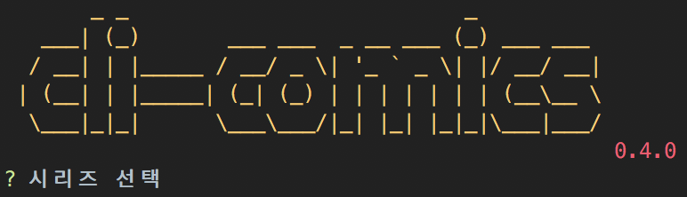

# cli-comics
[](https://www.npmjs.com/package/cli-comics)
> 💔 THIS PROJECT IS NO LONGER MAINTAINED(zangsisi is dead 😇)



```bash
$ npm -g i cli-comics
$ cli-comics
```

## related
- https://github.com/deptno/class-zangsisi
